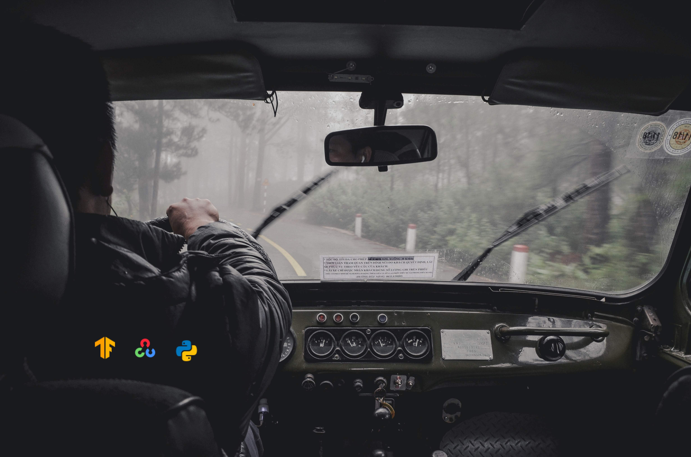

## 
# Drowsiness Detector
Drowsy driving is a serious and potentially life-threatening issue that contributes to road accidents worldwide. Fatigue and drowsiness can impair a driver's ability to react quickly and make sound judgments, leading to accidents with severe consequences. The application utilizes the OpenCV library for real-time video capture and processing, detecting whether a driver is Alert or Drowsy.


## Installation
1. Clone the repository:
```shell
git clone https://github.com/thebugged/drowsiness-detection.git
```

2. Change into the project directory: 
```shell
cd drowsiness-detection
```

3. Install the required dependencies: 
```shell
pip install -r requirements.txt
```


## Dataset
The dataset used for training and testing the drowsiness detector is available on Kaggle. You can download it from the following link:

[Train](https://www.kaggle.com/datasets/dheerajperumandla/drowsiness-dataset)
[Test](https://www.kaggle.com/datasets/adinishad/prediction-images)


## AI Model
To run the Drowsiness Detector, you can make use of the 'drowsy.h5' and 'drowsy.json' included in the repository and run the mainapp.py utilizing open-cv library.


### Training the Model
1. Ensure you have Jupyter Notebook installed. If not, you can install it using the following command:
```shell
   pip install jupyter notebook
```
2. Open the drowsy.ipynb Jupyter Notebook.
3. Run the notebook cells sequentially by clicking on Cell and selecting Run All.
4. After running all the cells, the 'drowsy.h5' and 'drowsy.json' file will be generated in the same directory as the notebook.

Make sure to place the saved model files in the same directory as the app (mainapp.py) before running the application.

### Running the Application

You can either run it from the terminal or from the run button in the code editor you're making use of.
```shell
# running from terminal
   python mainapp.py
```
or
```shell
# running from terminal
   python3 mainapp.py
```

